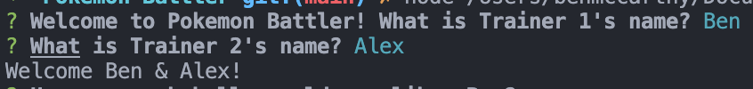
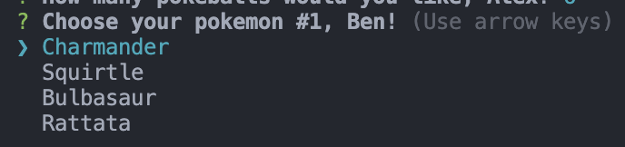
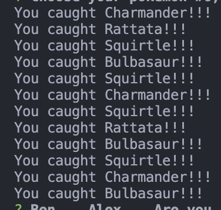
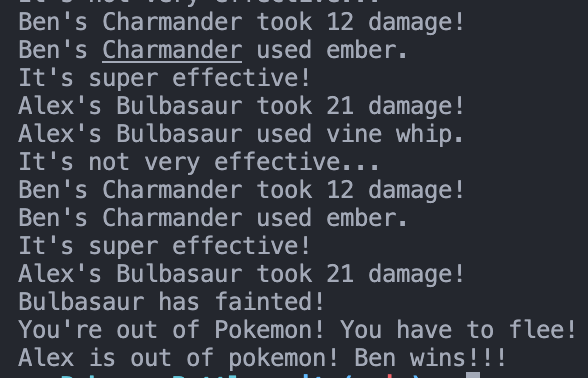

# Pokémon Battler!

## Description

Welcome to Pokémon Battler! Relive the nostalgia with this text-based Pokémon battle simulator.

## Skills

- **JavaScript**
- **Jest**
- **Node.js**
- **Object-Oriented Programming (OOP)**
- **Test-Driven Development**
- **Promises**
- **Inquirer**

## Setup

#### Clone the repository:

> Click the green `Code` button and copy the URL  

#### In your local machine's terminal, run:

> git clone https://github.com/Dimeben/react-hangman-game.git  

#### Once it has downloaded, run:

> cd /pokemon-battler  
> code .  

#### To begin, install npm & Node.js by following this link:

[Install npm and Node.js](https://docs.npmjs.com/downloading-and-installing-node-js-and-npm)

> Made using Node.js v22.4.1

#### Install the dependencies by running the following in your terminal:

> npm i

#### Running the game:

> Right-click on the inquirer.js file and copy the path.

> Open your terminal.

#### Enter the following command:

> node file-path-you-just-copied

> Press Enter and enjoy the game!

#### Have fun battling your favorite Pokémon!

## Images:

